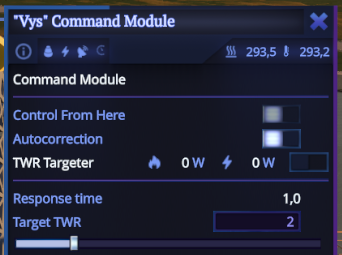
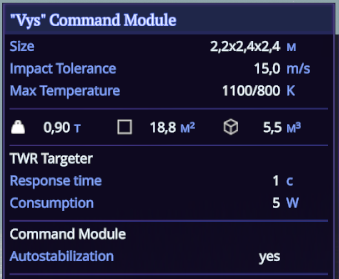

This example adds TWR targeter module, system, flight module panel and part tooltip. This module is also automatically added to all command pods. When command pod has this module you can set target TWR in the part panel during the flight:

When this module is enabled it will automatically change the throttle of all active engines to match the spacecraft TWR with the target one. It also will consume electricity and produce heat while working. 

Assembly tooltip will look like this:

## Concepts

### RocketPart

Base building block of any rocket. Consist of part properties and part modules.

### RocketPartModule

Adds functionality to the Rocket Part.

Responsibilites: 
- module state and config serialization / deserialization;
- adds itself to the appropriate system;
- provides the interface for displaying parameters in the part panel and tooltips;
- receives commands from part window UI, changes the state and routes it to the system.

### RocketSystem

This is where Rocket Part and Rocket Part Module functionality is implemented. It uses module data, rocket and other systems while executing.

### RocketPartPanel

UI of RocketPartModule displayed when you click on the rocket part during the flight.

## RocketPartSchema

Basically a rocket part template from which all rocket parts are created.